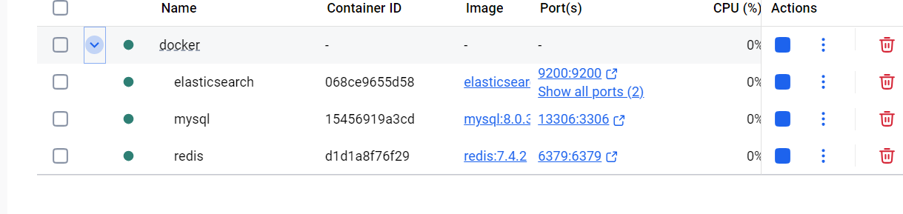

# 使用指南

> 为了简化环境配置流程，本项目采用 Docker 进行中间件部署。  
> 请确保您已在服务器或本地计算机上安装 Docker 和 Docker Compose。

## 🛠️ 本地开发

```bash
cd docker
docker-compose -f docker-compose.yaml up -d
```



## 🚀 部署服务

```bash
# 建议先修改各中间件的默认密码（出于安全考虑）
cd docker
docker-compose -f docker-compose-deploy.yaml up -d
```

